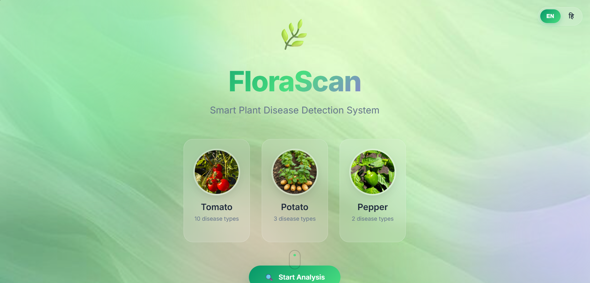
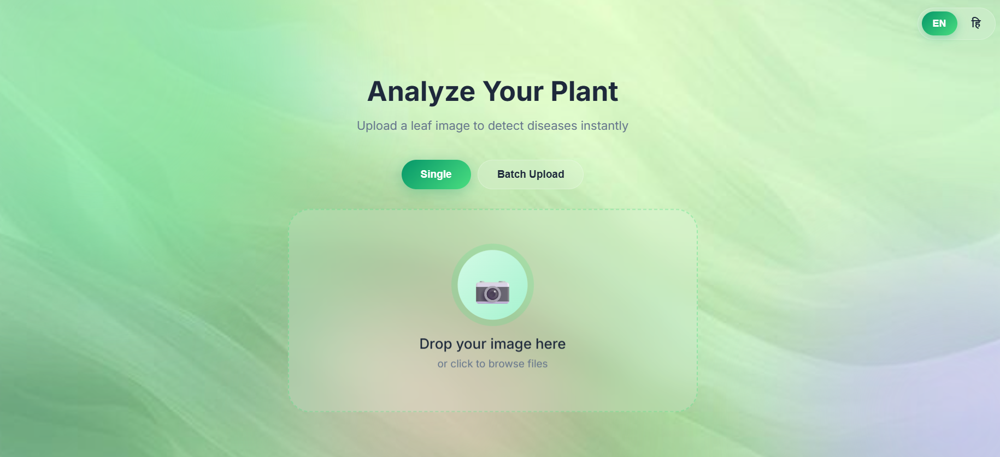
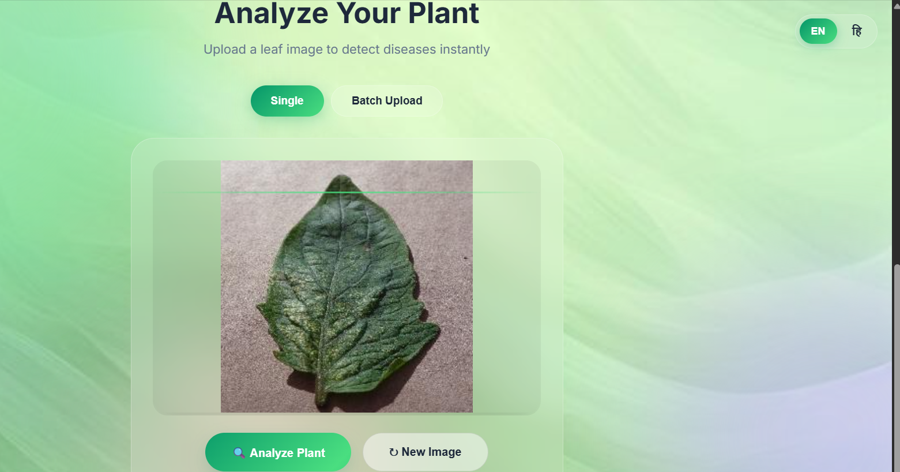
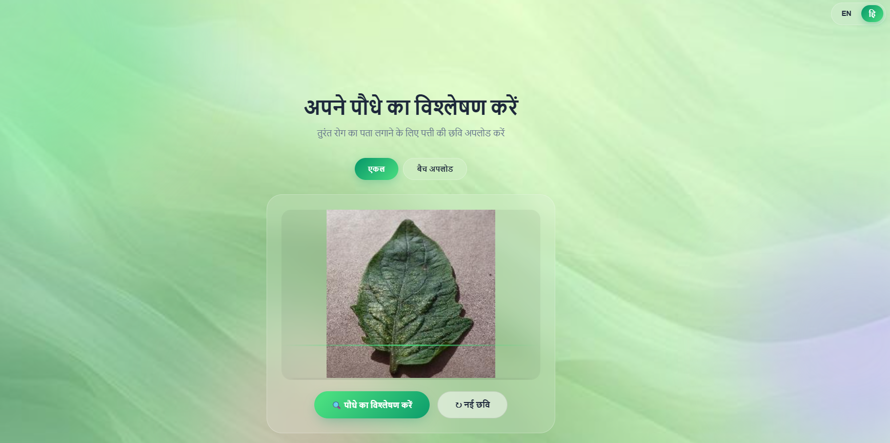
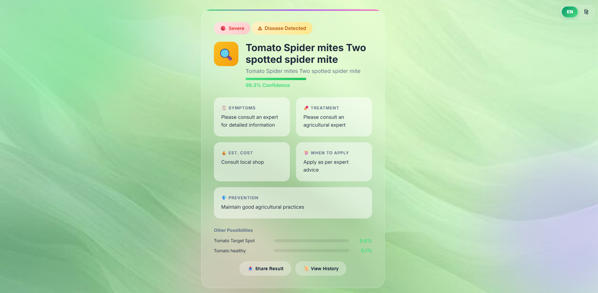

# 🌿 FloraScan - Plant Disease Detection

A web application for detecting diseases in plant leaves using deep learning and transfer learning with MobileNetV2.


## 📋 About the Project

FloraScan is a final year project that uses computer vision and deep learning to identify diseases in plant leaves. It can detect 15 different disease classes across Tomato, Potato, and Bell Pepper plants.

## ✨ Features

- 🔍 Disease detection from leaf images
- 🌱 Supports 15 disease classes (Tomato: 10, Potato: 3, Pepper: 2)
- 📦 Batch upload - analyze multiple images at once
- 🌐 Multi-language support (English and Hindi)
- ⚠️ Severity indicator (Mild/Moderate/Severe)
- 📜 Scan history - view past predictions
- 📤 Share results to clipboard
- 👨‍🌾 Farmer-friendly info with treatment cost, timing, and prevention tips
- 📚 Disease library popup for each plant

## 🚀 How to Use

1. Open the website
2. Upload a leaf image or drag and drop
3. Click "Analyze Plant"
4. View the disease name, symptoms, treatment, cost, and prevention
5. Use Share button to copy results
6. View History to see past scans
7. Switch to Batch Upload to analyze multiple images

## 📸 Screenshots

### Home Page


### Upload and Analyze




### Results


### Hindi Language


## 📊 Model Performance

| Model | Validation Accuracy |
|-------|---------------------|
| ANN Baseline | 7.5% |
| Basic CNN | 68.7% |
| Improved CNN | 80.4% |
| Transfer Learning | 83.5% |
| Fine-tuned Model | 84.5% |

## 🗂️ Project Structure

```
FloraScan/
├── app.py                  # Flask application
├── requirements.txt        # Dependencies
├── models/                 # Trained models
├── notebooks/              # Training notebooks
├── static/                 # CSS, JS, images
├── templates/              # HTML templates
└── screenshots/            # App screenshots
```

## ⚙️ Installation

1. Clone the repository
```
git clone https://github.com/saniaakhan9/-FloraScan-Plant-Disease-Detection-Using-Machine-Learning-.git
cd FloraScan
```

2. Create virtual environment
```
python -m venv .venv
.venv\Scripts\activate
```

3. Install dependencies
```
pip install -r requirements.txt
```

4. Run the application
```
python app.py
```

5. Open browser at http://localhost:5000

## 🌱 Supported Plants and Diseases

### 🍅 Tomato (10 classes)
Bacterial Spot, Early Blight, Late Blight, Leaf Mold, Septoria Leaf Spot, Spider Mites, Target Spot, Yellow Leaf Curl Virus, Mosaic Virus, Healthy

### 🥔 Potato (3 classes)
Early Blight, Late Blight, Healthy

### 🌶️ Pepper (2 classes)
Bacterial Spot, Healthy

## 🛠️ Technologies Used

- Python, Flask
- TensorFlow, Keras
- HTML, CSS, JavaScript
- MobileNetV2 (Transfer Learning)
- PlantVillage Dataset

## 👤 Author

**Sania Khan**  
Final Year Computer Science Student  
FloraScan - Plant Disease Detection (2025)
